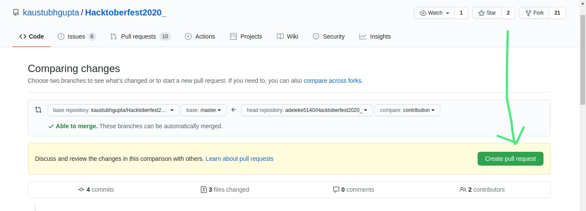

# Contributing Guidelines

Do you want to contribute to this project but don't know how? 
This documentation would help you during the process.
Contributions are always appreciated and **no contribution is too small.**

# Submitting Contributions
The following steps below outline how to make contributions to the existing project.

**Note:** You don't need to copy or type the dollar sign. 

## Step 0 : Find an issue(any issue you can work on)
- Take a look at the any Existing Issue you could work on or alternatively, create your **own** Issues!
- Wait for the Issue to be assigned to you after which you can start working on it.
- Note: Every change in this project should/must have an associated issue. 


## Step 1 : Fork the Project/Repository
- Fork this Repository. This will create a Local Copy of this Repository for you to work on.  This will make a copy on your Github Profile. Keep a reference to the original project in `upstream` remote.

Got to your terminal and write this commands.
```
$ git clone https://github.com/<your-username>/<repo-name>
$ cd <repo-name>
$ git remote add upstream https://github.com/<upstream-owner>/<repo-name>
```


- If you have already forked the project, update your copy before working.
```
$ git remote update
$ git checkout <branch-name>
$ git rebase upstream/<branch-name>
```

## Step 2 : Create a Branch
Create a new branch. Use its name to identify the issue your addressing.
```
# typing the command below in your terminal will create a new branch. You could call it: Branch_Name and switch to that branch 

$ git checkout -b branch_name

#for example

$ git checkout -b "contribution"
```

## Step 3 : Work on a specific issue
- Work on the issue(s) assigned to you. 
- Add all the files/folders needed.
- After you've made changes or made your contribution to the project add changes to the branch you've just created by:
```
# To add all new files to branch Branch_Name

$ git add .

#If you want to add individiual files for example an index.html file you made changes to, write the command.

$ git add index.html
```

This would add the file to the staging area.

## Step 4 : Write a commit
- To commit means to give a descriptive message that shows what you've modified:
```
# This message get associated with all files you have added to the staging area through the git add command.

$ git commit -m "your commit message"
```

## Step 5 : Work Remotely
- Now you are ready to push your work to the remote repository.
- The next step would be to take the local version you've worked on, on your computer and push it to github.
```
#To do that, write the following commands in your terminal

$ git push -u origin Branch_Name
```
- Here's how it's gonna look


- So that is the branch you'd create. I named mine contribution to address a particular issue but it could be anything you want.

## Step 6 : Compare Changes

- You can compare the changes you've made in your branch with those in the main project. Just click on the compare button.


## Step 7: Create a pull Request

- Next step would be to create a pull request and then adding a title and description to the changes you've made to the project.

- A good description is always better to properly convey what you did.



And, you're done. Your pull request would be submitted and reviewed and merged.

## In case you got stuck.
- It might seem like a lot if it's your first time but everyone started out new to github and open source at some point. If you missed a few steps, don't worry, try again. You'd definitely get better.

